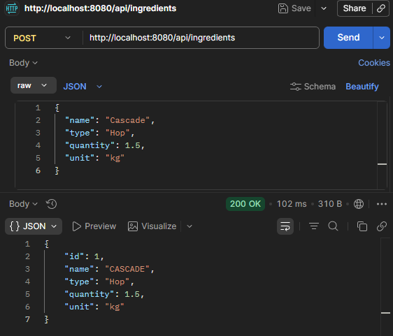
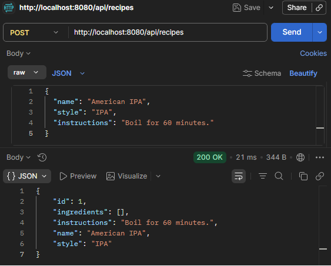
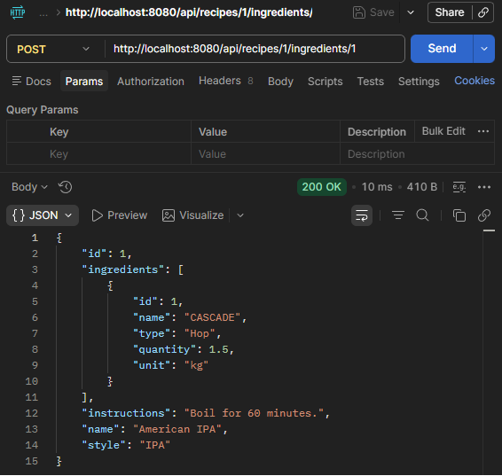
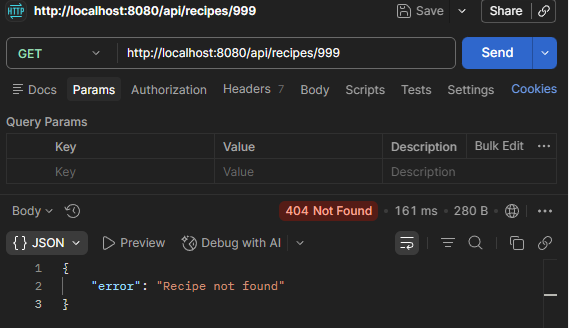

# Brewery Management API

**Version 1.1.0 - Functional MVP**

RESTful API built with Spring Boot for managing brewery recipes and ingredients.

## Overview

This project demonstrates backend development concepts such as layered architecture, JPA entity relationships, exception handling, and REST API design.

The API allows managing ingredients, recipes, and the relationships between them using a clean and structured Spring Boot architecture.

---

## Features

### Ingredient Management

- Create ingredients
- Retrieve all ingredients
- Retrieve ingredients by ID
- Update ingredients
- Delete ingredients
- Input validation
- Automatic name normalization
- Prevent duplicate ingredient names

### Recipe Management

- Create recipes
- Retrieve all recipes
- Retrieve recipes by ID
- Update recipes
- Delete recipes
- Associate ingredients with recipes

### API Features

- Layered architecture
- Global exception handling
- RESTful endpoint design
- PostgreSQL relational database
- Spring Data JPA persistence
- Hibernate ORM
- Request validation
- Database constraints

---

## Tech Stack

- Java 21
- Spring Boot
- Spring Data JPA
- Hibernate
- PostgreSQL
- Maven
- Lombok
- Bean Validation

---

## Architecture

The application follows a layered architecture:

```text
Controller
    ↓
Service
    ↓
Repository
    ↓
PostgreSQL Database
```

### Project Structure

```text
controller  -> REST endpoints
service     -> Business logic
repository  -> Data access layer
model       -> JPA entities
exception   -> Custom exceptions and global exception handling
```

---

## API Endpoints

### Ingredients

| Method | Endpoint |
|----------|----------|
| GET | /api/ingredients |
| GET | /api/ingredients/{id} |
| POST | /api/ingredients |
| PUT | /api/ingredients/{id} |
| DELETE | /api/ingredients/{id} |

### Recipes

| Method | Endpoint |
|----------|----------|
| GET | /api/recipes |
| GET | /api/recipes/{id} |
| POST | /api/recipes |
| PUT | /api/recipes/{id} |
| DELETE | /api/recipes/{id} |
| POST | /api/recipes/{recipeId}/ingredients/{ingredientId} |

---

## Running Locally

Clone the repository:

```bash
git clone https://github.com/fran9300/brewery-management-api.git
```

Navigate to the project folder:

```bash
cd brewery-management-api
```

Run the application:

```bash
mvn spring-boot:run
```

The API will be available at:

```text
http://localhost:8080
```

---

## Project Status

Functional MVP

The core API is fully functional and supports ingredient and recipe management, including entity relationships and exception handling.

Future improvements are planned and listed in the roadmap section.

---

## Database Model


The application uses a Many-to-Many relationship between recipes and ingredients through the `recipe_ingredients` join table.

Relationship:

```text
Recipe
    ↔ Many-to-Many ↔
Ingredient
```

---

## API Demonstration

### Create Ingredient



### Create Recipe



### Associate Ingredient to Recipe



### Error Handling



Examples:

- Creating ingredients
- Creating recipes
- Associating ingredients with recipes
- Successful API responses
- Error handling responses (404 Not Found)

---

## Roadmap

Future improvements:

- [ ] Swagger/OpenAPI documentation
- [ ] DTO implementation
- [ ] Unit testing
- [ ] Docker support
- [ ] Authentication and authorization
- [ ] Flyway database migrations

---

## Learning Goals

This project focuses on practicing:

- REST API design
- Layered architecture
- Dependency injection
- Entity relationships with JPA
- Exception handling
- Backend development using Spring Boot
- API development best practices

## Release Notes

### v1.1.0

Improvements:

- Migrated database from H2 to PostgreSQL
- Added entity validation using Bean Validation
- Added PUT endpoints for ingredients and recipes
- Added database constraint to prevent duplicate ingredients
- Improved persistence configuration
