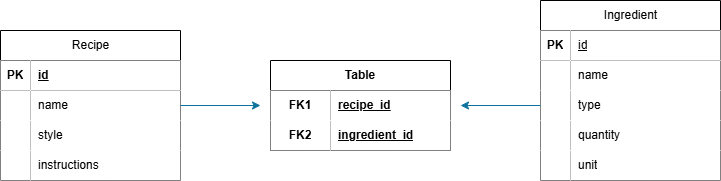

# Brewery Management API

RESTful API built with Spring Boot for managing brewery recipes and ingredients.

---

## Overview

This project demonstrates backend development concepts such as layered architecture, REST API design, DTO pattern, JPA entity relationships, validation, exception handling, and relational database management.

The API allows managing ingredients, recipes, and the relationships between them through a structured Spring Boot architecture.

---

## Contents

- [Overview](#overview)
- [Features](#features)
  - [Ingredient Management](#ingredient-management)
  - [Recipe Management](#recipe-management)
- [API Features](#api-features)
- [Tech Stack](#tech-stack)
- [Architecture](#architecture)
  - [Project Structure](#project-structure)
- [Database](#database)
- [Running Locally](#running-locally)
- [API Documentation](#api-documentation)
- [API Testing](#api-testing)
- [Testing](#testing)
- [API Endpoints](#api-endpoints)
  - [Ingredients](#ingredients)
  - [Recipes](#recipes)
- [Database Model](#database-model)
  - [Persistence Model](#persistence-model)
- [Error Handling](#error-handling)
- [Project Status](#project-status)
- [Roadmap](#roadmap)
- [Learning Goals](#learning-goals)

---

## Features

### Ingredient Management

- Create ingredients
- Retrieve all ingredients
- Retrieve ingredients by ID
- Update ingredients
- Delete ingredients
- Input validation
- DTO-based request and response handling
- Automatic name normalization
- Prevent duplicate ingredient names
- Database integrity validation

---

## Recipe Management

- Create recipes
- Retrieve all recipes
- Retrieve recipes by ID
- Update recipes
- Delete recipes
- Associate ingredients with recipes
- Manage Many-to-Many relationships using JPA

---

## API Features

- Layered architecture
- DTO pattern implementation
- Global exception handling
- RESTful endpoint design
- PostgreSQL relational database
- Spring Data JPA persistence
- Hibernate ORM
- Bean Validation
- Database constraints
- Swagger/OpenAPI documentation
- Docker Compose database environment
- Flyway database migrations
- Environment-based configuration
- Externalized database credentials

---

## Tech Stack

- Java 21
- Spring Boot 4
- Spring Data JPA
- Hibernate ORM
- PostgreSQL 16
- Maven
- Maven Wrapper
- Lombok
- Bean Validation
- Swagger/OpenAPI
- Postman
- Docker
- Flyway
- JUnit 5
- Mockito
- Spring Boot Test
- MockMvc

---

## Architecture

The application follows a layered architecture:

```
HTTP Request/Response
    |
    v
Controller
    |
    v
DTO (Request/Response)
    |
    v
Service
    |
    v
Entity / Model
    |
    v
Repository
    |
    v
Database
```

## Project Structure

```
controller  -> REST endpoints
service     -> Business logic
repository  -> Data access layer
dto         -> Request and Response objects
model       -> JPA entities
exception   -> Custom exceptions and global error handling
config      -> Application configuration classes (OpenAPI/Swagger)
resources   -> application properties, Flyway migrations and static resources

```

---

## Database

The project uses PostgreSQL running through Docker Compose.

Database configuration is managed through environment variables.

Database schema changes are managed using Flyway migrations.

Flyway automatically executes versioned SQL migration scripts when the application starts, keeping the database schema synchronized across different environments.

Migration files are located at:

```text
src/main/resources/db/migration
```
Example migration:

```text
V1__create_initial_schema.sql
```
Each migration represents a versioned database change and is executed only once.

Create a `.env` file:

```env
POSTGRES_DB=brewery_db
POSTGRES_USER=postgres
POSTGRES_PASSWORD=your_password

DB_URL=jdbc:postgresql://localhost:5432/brewery_db
DB_USERNAME=postgres
DB_PASSWORD=your_password
```

Start PostgreSQL:

```bash
docker compose up -d
```

Check container status:

```bash
docker ps
```

---

## Running Locally

Clone the repository and navigate to the project:

```bash
git clone <repository-url>
cd brewery-management-api
```

Start the application using Maven Wrapper:

### Windows

```bash
.\mvnw spring-boot:run
```

### Linux / Mac

```bash
./mvnw spring-boot:run
```

The API will be available at:

```
http://localhost:8080
```

---

## API Documentation

Swagger/OpenAPI documentation is available at:

```
http://localhost:8080/swagger-ui/index.html
```

Swagger allows exploring and testing all available endpoints directly from the browser.

---

## API Testing

The repository includes a Postman collection with predefined requests.

Included scenarios:

- Ingredient CRUD operations
- Recipe CRUD operations
- Recipe-Ingredient relationship management
- Validation scenarios
- Error handling responses

Collection:

```
postman/Brewery-Management-API.postman_collection.json
```

---

## Testing

The project includes automated tests covering:

- Service layer business logic
- Controller endpoint behavior
- Validation scenarios
- Database constraint error handling

Testing tools:

- JUnit 5
- Mockito
- Spring Boot Test
- MockMvc

Run tests:

```bash
.\mvnw clean test
```

---

## API Endpoints

### Ingredients

| Method | Endpoint |
|--------|----------|
| GET | `/api/ingredients` |
| GET | `/api/ingredients/{id}` |
| POST | `/api/ingredients` |
| PUT | `/api/ingredients/{id}` |
| DELETE | `/api/ingredients/{id}` |

---

### Recipes

| Method | Endpoint |
|--------|----------|
| GET | `/api/recipes` |
| GET | `/api/recipes/{id}` |
| POST | `/api/recipes` |
| PUT | `/api/recipes/{id}` |
| DELETE | `/api/recipes/{id}` |
| POST | `/api/recipes/{recipeId}/ingredients/{ingredientId}` |

---

## Database Model



The application uses a Many-to-Many relationship between recipes and ingredients.

Implemented through the join table:

```
recipe_ingredients
```

Relationship:

```
Recipe
    ↔ Many-to-Many ↔
Ingredient
```
---

### Persistence Model

The project uses JPA/Hibernate for ORM mapping.

Implemented relationships:

- Recipe ↔ Ingredient
  - Many-to-Many relationship
  - Managed through recipe_ingredients join table
  - Foreign key constraints handled by PostgreSQL

---

## Error Handling

The API uses centralized exception handling with custom responses.

Handled scenarios:

- Resource not found (404)
- Validation errors (400)
- Database constraint violations (409)

---

## Project Status

The API currently includes:

- Ingredient management
- Recipe management
- DTO architecture
- PostgreSQL persistence
- Docker database environment
- Validation
- Exception handling
- Swagger documentation
- Postman testing collection
- Automated tests with JUnit and Mockito

---

## Roadmap

Future improvements:

- [ ] Authentication and authorization
- [ ] CI/CD pipeline with GitHub Actions
- [ ] SonarQube quality analysis
- [ ] Automated code formatting
- [ ] Integration testing with Testcontainers
- [ ] Dockerize application service
- [ ] Logging and monitoring improvements

---

## Learning Goals

This project focuses on practicing:

- REST API design
- Spring Boot architecture
- Dependency injection
- DTO pattern
- Entity relationships with JPA
- Exception handling
- Database persistence
- Backend development best practices


